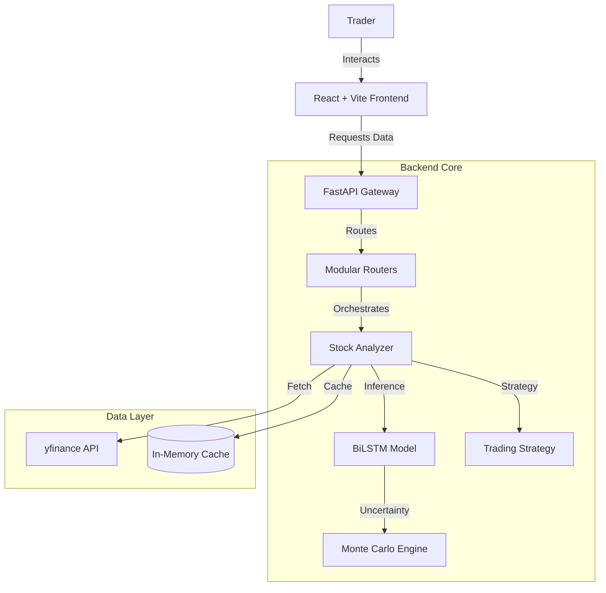

# 🇸🇦 Saudi Stock AI Analyzer (TASI Intelligence)

<div align="center">


**Institutional-Grade Market Intelligence for the Saudi Exchange (Tadawul)**

[Features](#features) • [Architecture](#architecture) • [Getting Started](#getting-started) • [Tech Stack](#tech-stack)

</div>

---

## 🚀 Overview

**Saudi Stock AI Analyzer** is a state-of-the-art financial analytics platform designed to bring hedge-fund quality insights to the Saudi Market. By combining **Deep Learning (BiLSTM + Attention)** with **Bayesian Uncertainty Estimation**, it moves beyond simple price prediction to provide scientifically calibrated trade confidence.

Built with a **"Vibe Coding"** philosophy, the project merges rapid development with enterprise stability, featuring a high-performance **Vite** frontend and a modular **FastAPI** backend.

## ✨ Key Features

### 🧠 Advanced AI Core
- **BiLSTM + Multi-Head Attention**: Captures long-term dependencies and market sentiment nuances.
- **Monte Carlo Dropout**: Provides calibrated confidence scores (25-95%) by quantifying model uncertainty, not just point predictions.
- **Market Regime Detection**: HMM-based classification (Bull/Bear/Sideways) to adapt strategies dynamically.

### 📊 Professional Dashboard
- **Real-Time Visualization**: Interactive charts powered by Lightweight Charts.
- **Instant Response**: Optimized with **React Query** for caching and background updates.
- **Smart Scanners**: Automatically ranks stocks by potential upside and signal strength.

### 🛡️ Risk Management
- **Probabilistic Backtesting**: Runs Monte Carlo simulations to stress-test strategies.
- **Comprehensive Metrics**: VaR (Value at Risk), Sharpe Ratio, Sortino Ratio, and Max Drawdown.

## 🏗️ Architecture

The system is built as a distributed application with clean separation of concerns:



## 🛠️ Tech Stack

### Frontend
- **Framework**: React 18
- **Build Tool**: Vite (Lightning fast HMR)
- **State Management**: TanStack Query (React Query)
- **Styling**: Tailwind CSS + Framer Motion
- **Charting**: TradingView Lightweight Charts
- **Testing**: Vitest + React Testing Library

### Backend
- **API**: FastAPI (High performance async framework)
- **ML Engine**: PyTorch (Advanced LSTM, Attention)
- **Data Processing**: Pandas, NumPy, Scikit-learn
- **Testing**: Pytest

## ⚡ Getting Started

### Prerequisites
- Python 3.10+
- Node.js 18+

### 1. Backend Setup
```bash
cd backend
pip install -r requirements.txt
python -m uvicorn app:app --reload
```

### 2. Frontend Setup
```bash
cd frontend
npm install
npm run dev
```

The application will be available at `http://localhost:3000`.

## 🧪 Testing

We maintain high code quality standards:

```bash
# Backend Tests
cd backend
pytest

# Frontend Tests
cd frontend
npm run test
```

## 📈 Roadmap
- [x] Migrate to Vite
- [x] Implement Monte Carlo Uncertainty
- [ ] Add Portfolio Optimization Agent
- [ ] Deploy to Cloud (AWS/Azure)

---

<div align="center">
  <sub>Engineered by Abdulrahman Asiri with ❤️ and AI</sub>
</div>
